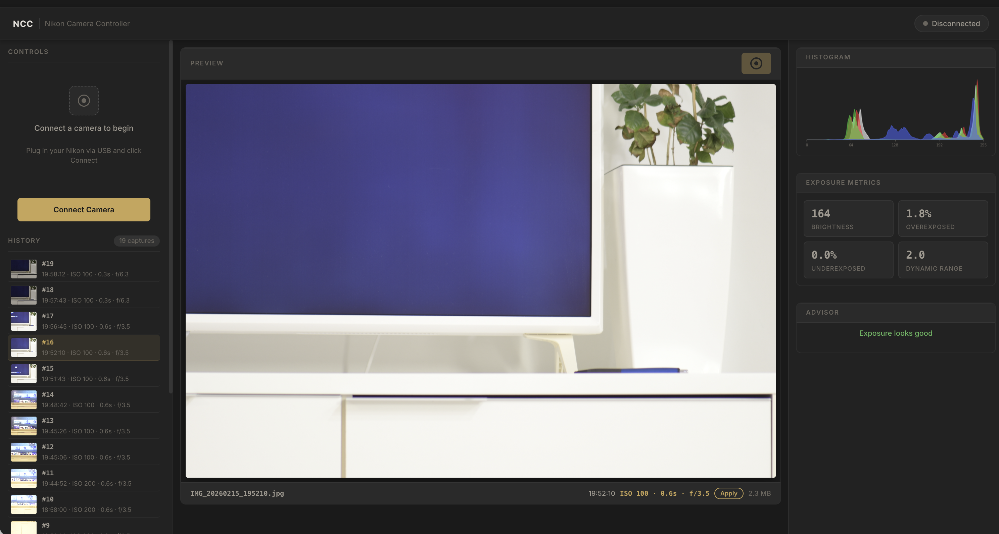

# Nikon Camera Controller (NCC)

Web-based application for controlling Nikon cameras via USB. Provides a browser UI for camera settings, image capture, and real-time exposure analysis.

Built with Python/[FastHTML](https://fastht.ml) + HTMX. Runs locally on macOS.



## Supported Cameras

- Nikon D7500
- Nikon Z6 III
- Other Nikon models with gPhoto2 PTP/MTP support

## Features

- **Camera Control** — Connect/disconnect, adjust ISO, shutter speed, aperture, white balance, exposure compensation
- **Image Capture** — Autofocus and shutter release from the browser, JPEG and NEF support
- **Exposure Analysis** — RGB + luminance histograms, brightness/clipping metrics, dynamic range estimation
- **Exposure Advisor** — Automated suggestions for improving exposure (adjust ISO, shutter speed)
- **Capture History** — Session history with thumbnails, restore previous sessions from disk
- **Apply Settings** — Re-apply camera settings from any previous capture's EXIF data

## Requirements

- macOS (primary platform)
- Python 3.11+
- [gPhoto2](http://gphoto.org/) (`brew install gphoto2`)
- Nikon camera connected via USB in PTP/MTP mode

## Installation

```bash
# Clone the repository
git clone https://github.com/your-username/nikon-camera-controller.git
cd nikon-camera-controller

# Install gPhoto2
brew install gphoto2

# Create and activate virtual environment
python3.11 -m venv venv
source venv/bin/activate

# Install Python dependencies
pip install -r requirements.txt
```

## Usage

```bash
# Activate virtual environment
source venv/bin/activate

# Start the application
python app/main.py
```

Open [http://localhost:5002](http://localhost:5002) in your browser.

### Workflow

1. Connect your Nikon camera via USB
2. Click **Connect Camera** in the sidebar
3. Adjust settings (ISO, shutter speed, aperture) using the dropdowns
4. Click the shutter button to capture an image
5. Review the histogram, exposure metrics, and advisor suggestions
6. Click previous captures in the History panel to review them

### macOS Note

macOS automatically grabs PTP camera devices. The application handles this by running `killall PTPCamera` when connecting. If the camera is not detected, try disconnecting and reconnecting the USB cable.

## Development

```bash
# Run tests
pytest tests/

# Linting
ruff check app/ tests/

# Type checking
mypy app/

# Format code
black app/ tests/
```

## Architecture

```
app/
├── main.py              # FastHTML routes (wires everything together)
├── camera/              # Camera control (gPhoto2 wrapper)
│   ├── controller.py    # CameraController class
│   ├── settings.py      # CameraSettings dataclass
│   ├── capabilities.py  # CameraCapabilities dataclass
│   └── exceptions.py    # Custom exception hierarchy
├── analysis/            # Image processing (Pillow + NumPy)
│   ├── processor.py     # ImageAnalyzer — histograms, metrics, EXIF
│   ├── histogram.py     # Histogram PNG generation (matplotlib)
│   └── advisor.py       # Exposure suggestions engine
├── storage/             # File management
│   ├── session.py       # In-memory capture history
│   └── files.py         # File path utilities
├── components/          # FastHTML UI components (HTMX fragments)
│   ├── status.py        # Connection status indicator
│   ├── controls.py      # Settings dropdowns
│   ├── viewer.py        # Image preview panel
│   ├── histogram.py     # Histogram display
│   ├── metrics.py       # Exposure metrics grid
│   ├── advisor.py       # Suggestion cards with Apply buttons
│   └── history.py       # Capture history sidebar
└── static/css/style.css # Custom styles
```

## License

CC-BY-NC-4.0. See [LICENSE](LICENSE) for details.
